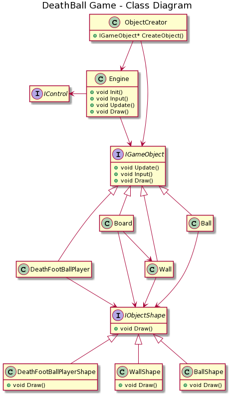
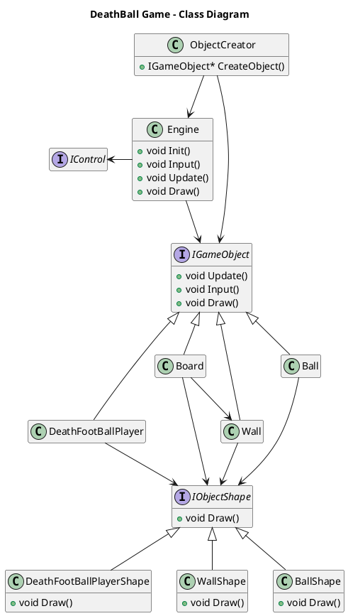

# DeathBall
DeathBall - Sadistic football using OpenGL

### UML Diagram

### Materials
* [OpenGL Tutorial ](https://learnopengl.com/Introduction/)
* [Plant Uml Generator ](https://www.planttext.com)
* [Plant Uml Doc](https://plantuml.com/class-diagram)

